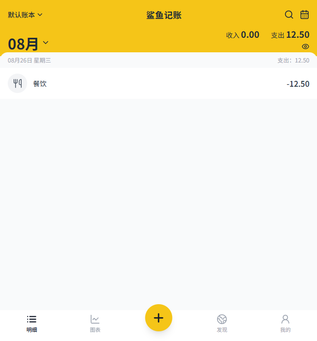
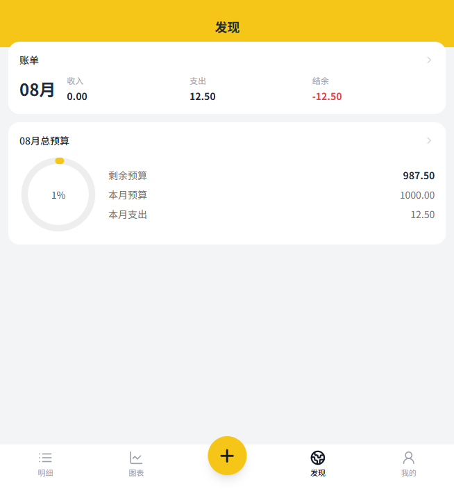

# 🦈 鲨鱼记账 Shark Ledger

> 轻量、无广告、可离线、可加密云备份的个人记账 PWA。

**[📱 在线体验](https://joshjeoa.github.io/shark-ledger/)** ｜ 建议用 iPhone / Android 手机打开，或桌面浏览器切换到移动视口。


## ✨ 特性

- **记一笔** — 自绘数字键盘，支出/收入、分类、备注、日期一步完成，3 秒记完一笔
- **明细** — 按日分组流水、月度切换、全文搜索、30 天回收站（软删除可恢复）
- **图表** — 周/月/年收支趋势折线图、分类排行榜，Chart.js canvas 渲染，触控流畅
- **预算** — 月度预算环 + 剩余额度实时展示，超支一目了然
- **多账本** — 生活账 / 报销账分账本独立核算
- **数据自由** — CSV / JSON 一键导入导出；CSV 带 BOM + CRLF，Excel / WPS 打开中文不乱码
- **云备份（可选）** — GitHub Gist / WebDAV / R2 三种同步源，AES-GCM 端到端加密后才上传
- **隐私优先** — 零后端、零广告、零会员、零埋点统计，数据只存你的设备
- **存储三级降级** — IndexedDB → localStorage → 内存，Safari 私密模式也能正常使用
- **PWA** — 添加到主屏幕获得类原生体验，离线状态下全功能可用（云同步除外）

## 📱 界面

| 明细 | 图表 | 预算 |
|:---:|:---:|:---:|
|  |  |  |

## 🛠 技术栈

| 层 | 选型 | 说明 |
|---|---|---|
| 构建 | Vite 5 + React 18 + TypeScript (strict) | `build.target='es2020'`，兼容 iOS 15+ |
| 样式 | TailwindCSS 3.4 + CSS Variables | 锁 v3：v4 的 oklch 不兼容 iOS < 15.4 |
| 路由 / 状态 | React Router 6 + Zustand 4 | 无模板代码 |
| 存储 | IndexedDB（idb 封装 repository） | 金额一律整数分存储，杜绝浮点误差 |
| 图表 | Chart.js 4 | 路由级懒加载，触控性能好 |
| PWA | vite-plugin-pwa (Workbox) | 离线缓存 + 更新检测提示 |

## 🚀 快速开始

```bash
git clone https://github.com/joshjeoa/shark-ledger.git
cd shark-ledger
npm install
npm run dev        # http://localhost:5173
```

生产构建：

```bash
npm run build      # 产物输出到 dist/
npm run preview    # 本地预览生产构建
```

## 📦 部署

### GitHub Pages（本项目默认）

仓库内置 [`.github/workflows/deploy.yml`](.github/workflows/deploy.yml)，推送到 `main` 分支即自动构建并发布：

1. Fork 或新建仓库并推送代码
2. 仓库 **Settings → Pages → Build and deployment → Source** 选择 **GitHub Actions**
3. 等待 Actions 跑完，访问 `https://<用户名>.github.io/<仓库名>/`

项目使用 `base: './'` 相对路径构建，无需修改任何配置即可部署在任意子路径下。

### 其他静态托管

`npm run build` 后把 `dist/` 目录部署到任意静态托管（Cloudflare Pages、Vercel、Netlify 等）皆可。

## ☁️ 云备份说明

默认关闭。开启后数据先经 **AES-GCM 加密**（PBKDF2 派生密钥，口令仅存本机）再上传，支持三种同步源：

| 源 | 说明 |
|---|---|
| GitHub Gist | 默认推荐，CORS 友好、零基建，使用个人访问令牌 |
| WebDAV | 需自部署 [`deploy/relay-worker.ts`](deploy/relay-worker.ts)（Cloudflare Worker CORS 中继），如坚果云等无 CORS 头的服务 |
| R2 / S3 | 对象存储备选方案 |

## 🔐 隐私与安全设计

- 纯前端应用，无任何后端服务器收集数据
- 密钥 / 口令不硬编码、不上传、不入仓库，仅存本机 IndexedDB
- 构建时注入严格 CSP（`script-src 'self'`），无 CDN 字体 / 图标 / 统计脚本
- 删除走 30 天软删除，误删可从回收站恢复

## 📁 目录结构

```
src/
  components/   # TabBar、Sheet、Toast、NumberKeyboard、SyncChip 等自绘组件
  pages/        # 明细 / 图表 / 发现 / 我的 / 设置子页
  features/     # 记一笔面板（全局挂载）
  db/           # idb 封装、schema、迁移、repository
  sync/         # SyncAdapter 接口（gist/webdav/r2）、AES-GCM 加密
  store/        # zustand 状态切片
  utils/        # money / date / csv / compat（iOS < 15.4 回退）等工具
deploy/         # WebDAV CORS 中继 Worker（可选部署）
docs/           # 需求规格说明书、界面截图
```

## 🗺 Roadmap

- [ ] 标签系统
- [ ] 多币种
- [ ] 周期记账
- [ ] 资产管家

## 📄 License

[MIT](LICENSE) © Zhongyuan Zhang
